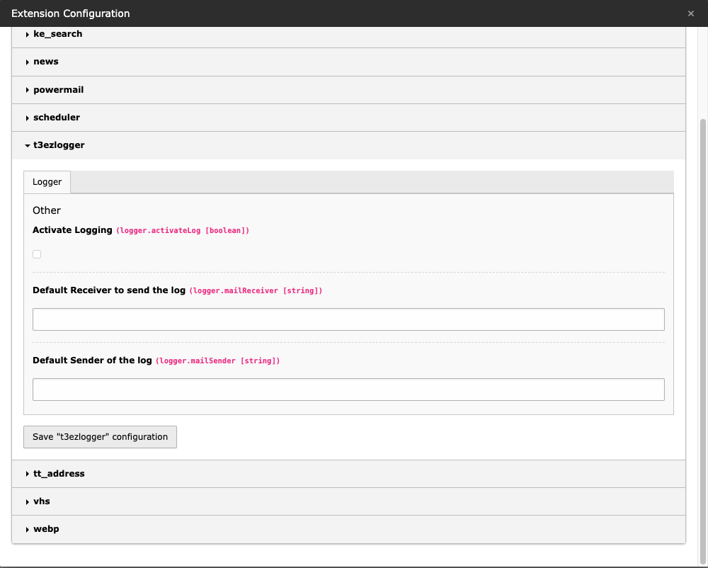

# T3-EZ-Logger
Sometimes you just need a little workaround to debug your code

## Install
```
composer req bokuno/t3-ez-logger
```
## How to use this logger
The logger needs to be activated to write into the log file. So you can easily de-/activate this feature without installing and removing the extension.

Then you can use this code to log:
```
use BokuNo\T3EZLogger\Domain\Model\EZLogger;
...
$ezlogger = new EZLogger("filename.log");
$ezlogger->write("I want to debug this");
...
```
check for log in var/log/filename.log

## Options
### prepend current date to filename
just add "true" to constructor to prepend the current date in format "Ymd" to the filename
```
$ezlogger = new EZLogger("filename.log",true);
```

### send mail
To send the log per mail you can easily call this function:
```
$ezlogger = new EZLogger("filename.log");
....
$ezlogger->sendMail($subject,$to,$sender);
...
```
None of these parameters are required, if they are set in the extension configuration. Further more mails will only be send if the logging is activated (else the log file is empty...)


## Extension configuration

### activateLog
sometimes you don't want to flood your server with logs, or you log to much and have performance problems, so I made an option to easily toggle if ezlogger writes into the log or not.

### mailReceiver
if activateLog = 1, the system can send out the logfile per mail to a predefined receiver. You can configure the receiver globally in the extension or in the function call

### mailSender
if activateLog = 1, the system can send out the logfile per mail to a predefined receiver. You can configure the sender globally in the extension or in the function call


## But why ? I can log directly via \TYPO3\CMS\Core\Log\LogManager

Because when I need to debug strange things in production, I don't want to flood the server with unnecessery logs from extensions I cannot fix for reasons.

## TODO:
just some features that are nice to have, that you don't want to implement every single time...
- Scheduler to remove log after n days
- ~~Send Mail Function to directly send your log via mail to predefined mail address~~
- ~~Timestamp to prepend to log file?~~
